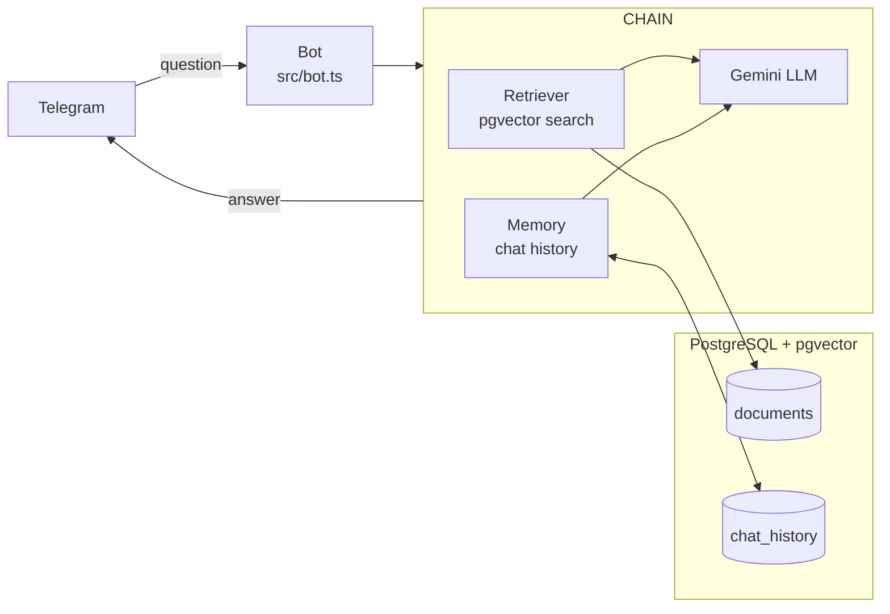

# telegram-bot-llm

**Step 2 of 3 in the Telegram Bot learning path.**

A Telegram bot that answers questions using Retrieval Augmented Generation (RAG) with Google Gemini. Stores document embeddings in pgvector and maintains per-session conversation history.

---

## Architecture



---

## Stack

| Tool | Purpose |
|------|---------|
| Node.js 20 | Runtime |
| TypeScript | Type safety |
| grammy | Telegram Bot framework |
| @google/generative-ai | Gemini LLM + embeddings |
| pgvector | Vector similarity search |
| PostgreSQL 16 | Storage for documents and history |
| Docker | Container packaging |

---

## Project Structure

```
src/
├── bot.ts                        # Entry point
├── config/env.ts                 # Environment validation
├── agent/
│   ├── embeddings.ts             # Gemini text-embedding-004
│   ├── retriever.ts              # pgvector cosine similarity search
│   ├── memory.ts                 # Per-session chat history (Postgres)
│   └── chain.ts                  # RAG pipeline: retrieve → augment → generate
├── handlers/
│   └── question.ts               # Telegram message handler
├── middleware/logger.ts
└── vectorstore/db.ts             # Postgres pool + schema init

scripts/
└── ingest.ts                     # Embed and store corpus documents

docs/
└── corpus/                       # Place your .md/.txt knowledge files here
    └── example.md
```

---

## Quick Start

```bash
# 1. Install
make install

# 2. Configure
cp .env.example .env
# Set BOT_TOKEN and GEMINI_API_KEY

# 3. Start database
make db

# 4. Ingest knowledge base documents
# Add .md or .txt files to docs/corpus/, then:
make ingest

# 5. Run bot
make dev
```

---

## Commands

| Command | Description |
|---------|-------------|
| `/start` | Welcome message |
| `/clear` | Clear conversation history for this chat |
| Any text | Ask a question — answered via RAG + Gemini |

---

## Tutorial

See [docs/tutorial.md](docs/tutorial.md) for a complete walkthrough: embeddings, vector search, RAG pipeline, session memory, and sequence diagrams.

---

## Previous / Next

- **Step 1**: [telegram-bot-starter](https://github.com/LucasBiason/telegram-bot-starter) — grammy basics
- **Step 3**: [telegram-stateful-backend](https://github.com/LucasBiason/telegram-stateful-backend) — state machines + event-driven
