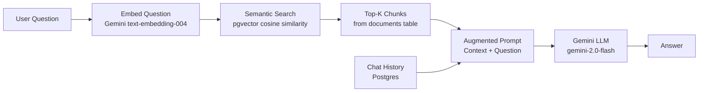
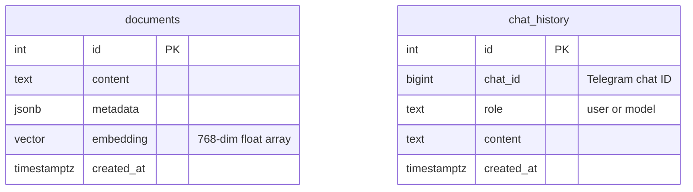
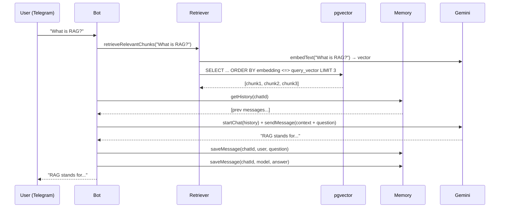

# Telegram Bot with LLM + RAG — Tutorial

## Objective

Build a Telegram bot that answers questions using Retrieval Augmented Generation (RAG): given a user question, find relevant documents from a vector database and use Gemini to generate a context-aware answer, maintaining conversation history per session.

---

## 1. Core Concepts

### What is RAG?

RAG (Retrieval Augmented Generation) solves a fundamental limitation of LLMs: they only know what they were trained on. RAG adds a retrieval step before generation, injecting fresh, domain-specific knowledge as context.



### What is a Vector Embedding?

An embedding is a list of numbers (a vector) that represents the semantic meaning of a text. Similar texts produce similar vectors. pgvector stores these vectors and finds the nearest ones using cosine similarity.

```
"How does RAG work?" → [0.12, -0.34, 0.87, ... 768 numbers]
"Explain RAG"        → [0.11, -0.33, 0.85, ... 768 numbers]  ← similar!
"What is the weather?" → [-0.45, 0.21, -0.12, ...]           ← different
```

---

## 2. Architecture

```mermaid
flowchart TD
    TG[Telegram] -->|text message| BOT[Bot\nsrc/bot.ts]
    BOT --> LOG[Logger Middleware]
    LOG --> QH[Question Handler\nsrc/handlers/question.ts]
    QH --> CHAIN[RAG Chain\nsrc/agent/chain.ts]

    subgraph CHAIN
        CHAIN --> RET[Retriever\nembeds query + searches pgvector]
        CHAIN --> MEM[Memory\nloads chat history]
        RET & MEM --> GEM[Gemini LLM]
        GEM --> SAVE[Save to history]
    end

    subgraph Database[PostgreSQL + pgvector]
        DOC[(documents\nchunks + embeddings)]
        HIST[(chat_history\nper chat_id)]
    end

    RET --> DOC
    MEM --> HIST
    SAVE --> HIST
    CHAIN --> BOT
    BOT --> TG
```

---

## 3. Database Schema



**`documents`**: stores text chunks with their vector embeddings. The `embedding` column uses the `vector(768)` type from pgvector, indexed with `ivfflat` for approximate nearest neighbor search.

**`chat_history`**: stores conversation turns per Telegram `chat_id`. The `chat_id` is the unique identifier for each conversation (private chat or group).

---

## 4. Step-by-Step Setup

### 4.1 Prerequisites

- Node.js 20+
- Docker + Docker Compose
- Telegram Bot Token (from @BotFather)
- Gemini API Key (from [aistudio.google.com](https://aistudio.google.com))

### 4.2 Configure environment

```bash
cp .env.example .env
```

Edit `.env`:
```bash
BOT_TOKEN=your_telegram_bot_token
GEMINI_API_KEY=your_gemini_api_key
```

### 4.3 Start the database

```bash
make db
# Starts PostgreSQL with pgvector extension
```

### 4.4 Add documents to the corpus

Place `.md` or `.txt` files in `docs/corpus/`. These become your knowledge base.

### 4.5 Run the ingest script

```bash
make ingest
```

This script:
1. Reads files from `docs/corpus/`
2. Splits each file into 500-character chunks
3. Calls `text-embedding-004` to get a 768-dimension vector for each chunk
4. Inserts chunk + vector into `documents` table

### 4.6 Start the bot

```bash
make dev
```

---

## 5. RAG Chain — Step by Step



---

## 6. Key Implementation Details

### Session memory per chat_id

Each Telegram chat has a unique `chat_id`. By scoping history to this ID, each user or group gets its own isolated conversation context. The last `MAX_HISTORY_MESSAGES` are loaded for each request.

```typescript
const history = await getHistory(chatId);
// History is passed to Gemini's startChat({ history })
// so the model knows what was said before
```

### Why cosine similarity?

Cosine similarity measures the angle between two vectors — it compares direction (meaning) rather than magnitude. A score of 1.0 means identical meaning, 0.0 means unrelated.

```sql
-- pgvector operator <=> computes cosine distance (1 - similarity)
-- We convert to similarity: 1 - distance
SELECT 1 - (embedding <=> $1::vector) AS similarity
FROM documents
ORDER BY embedding <=> $1::vector
LIMIT 3;
```

---

## 7. Extending the Knowledge Base

To add more knowledge:
1. Drop `.md` or `.txt` files into `docs/corpus/`
2. Run `make ingest`
3. New content is immediately available to the bot

To clear all documents and re-ingest:
```sql
TRUNCATE documents;
```
Then run `make ingest` again.

---

## 8. Key Takeaways

| Concept | What to remember |
|---------|-----------------|
| Embedding | Text → dense vector; similar texts have close vectors |
| Cosine similarity | Measures semantic closeness; used for retrieval |
| RAG | Retrieval + Generation: inject fresh context before LLM call |
| pgvector | Postgres extension for storing and searching vectors |
| Chat history | Scoped by `chat_id`; gives the LLM conversation context |
| Ingest script | One-time operation to embed and store corpus documents |

---

## Next Step

Proceed to **telegram-stateful-backend** to add state machines and event-driven patterns.
